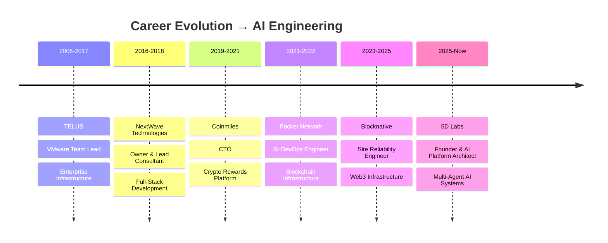

<h1 align="center">
  
</h1>

<p align="center">
  <a href="https://linkedin.com/in/jonathonfritz"></a>
  <a href="mailto:j@jonathonfritz.com"></a>
  <a href="https://github.com/5dlabs/cto"></a>
</p>

<br/>

## 🧠 Building Autonomous AI Systems

I architect **multi-agent AI systems that ship production code**. My work focuses on orchestrating specialized AI agents through complex workflows—from initial design to deployed features—without human intervention.

```
🔥 Currently building: Cognitive Task Orchestrator (CTO)
   └── 13 AI agents collaborating autonomously
   └── Built entirely in Rust for performance & reliability
   └── Self-healing infrastructure that fixes its own failures
```

<br/>

## 🚀 Featured Project: Cognitive Task Orchestrator

<a href="https://github.com/5dlabs/cto">
  
</a>

**The CTO Platform** is an open-source AI engineering platform where autonomous agents write, test, and ship production code.

### 🤖 The Agent Team
| Agent | Role | Specialty |
|-------|------|-----------|
| **Rex** 🦖 | Orchestrator | Coordinates all agents, manages workflows |
| **Blaze** 🔥 | Implementer | Writes production code |
| **Morgan** 📐 | Architect | System design & planning |
| **Sentinel** 🛡️ | Security | Code review & vulnerability scanning |
| **Pixel** 🎨 | Frontend | UI/UX implementation |
| **Echo** 🔍 | QA | Testing & quality assurance |

<br clear="right"/>

### ✨ Key Features
- **Model Context Protocol (MCP)** server supporting Claude, Cursor, Codex, Gemini
- **Self-healing infrastructure** with 9 alert types and auto-remediation
- **Bare-metal provisioning** across 7+ cloud providers
- **Real-time streaming** of agent activities to Linear

<br/>

## 🛠️ Tech Stack

<table>
<tr>
<td align="center" width="150">

### AI & Agents
</td>
<td>


</td>
</tr>
<tr>
<td align="center">

### Systems
</td>
<td>


</td>
</tr>
<tr>
<td align="center">

### Platform
</td>
<td>


</td>
</tr>
<tr>
<td align="center">

### Observability
</td>
<td>


</td>
</tr>
</table>

<br/>

## 📊 GitHub Stats

<p align="center">
  
  
</p>

<br/>

## 🏢 Professional Journey



<br/>

## 💡 What I'm Exploring

- 🔬 **Agentic workflows** that can handle complex, multi-step software tasks
- 🧬 **Self-improving systems** where AI agents learn from their failures
- 🌐 **Decentralized AI infrastructure** running on bare-metal clusters
- 📡 **Real-time collaboration** between humans and AI agent teams

<br/>

---

<p align="center">
  
</p>

<p align="center">
  <i>🚀 "The best way to predict the future is to build it—with AI agents that never sleep."</i>
</p>

